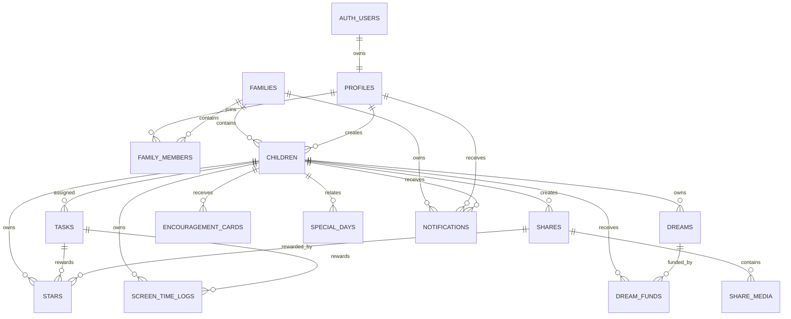

# 小小夢想家 Family 資料庫架構規劃

版本：1.0  
日期：2026-06-23  
狀態：規劃完成，尚未建立 Supabase migration  
範圍：孩子端 5 頁、家長端 5 頁驗收完成後的核心資料模型

## 1. 文件目的

本文件定義下一階段 Supabase PostgreSQL 核心資料模型，只進行架構規劃，不建立資料表、不修改 migration、不串接前端功能。

本次規劃的 11 張核心資料表：

1. `children`
2. `tasks`
3. `stars`
4. `dreams`
5. `dream_funds`
6. `shares`
7. `share_media`
8. `encouragement_cards`
9. `screen_time_logs`
10. `special_days`
11. `notifications`

下列既有基礎表不在本次重畫範圍，但仍是必要依賴：

- `auth.users`：Supabase Auth 使用者
- `profiles`：家長公開資料
- `families`：家庭空間
- `family_members`：使用者與家庭關係
- `child_devices`：孩子平板與登入裝置

## 2. 核心設計原則

### 2.1 家庭隔離

- 所有業務資料都必須包含 `family_id`。
- RLS 以 `family_members` 的 active membership 判斷存取權。
- 所有 `child_id` 必須屬於同一筆 `family_id`，不能只依賴應用程式檢查。
- 建議在 `children` 建立 `unique (family_id, id)`，其他表使用 `(family_id, child_id)` 複合外鍵。

### 2.2 帳務採不可變動流水帳

- `stars` 是星星收支流水帳，不直接存星星餘額。
- `dream_funds` 是夢想基金流水帳，不直接把歷史交易覆寫成新餘額。
- `screen_time_logs` 是平板分鐘異動與使用紀錄。
- 餘額由流水帳加總或由 materialized view / summary table 加速取得。
- 更正錯誤交易時新增反向交易，不直接修改歷史金額。

### 2.3 金額與時間

- 金額統一使用 `numeric(12,2)`，不使用浮點數。
- 星星與分鐘使用 `integer`。
- 實際事件時間使用 `timestamptz`。
- 純日期事件如生日、任務日期使用 `date`。
- 顯示時區預設採家庭或使用者的 `Asia/Taipei` 設定。

### 2.4 軟刪除與稽核

- 主檔型資料使用 `archived_at` 或狀態欄位，不立即實體刪除。
- 流水帳與通知紀錄原則上不可由一般使用者刪除。
- 所有可由家長建立的資料保留 `created_by`。
- `created_at`、`updated_at` 統一使用 `timestamptz`。

### 2.5 媒體安全

- 兒童照片、影片與錄音只能存在 private Supabase Storage bucket。
- 資料庫只儲存 Storage path、MIME type、檔案大小等 metadata。
- 不在資料表保存永久公開 URL。
- 前端讀取媒體時使用短效 signed URL。

## 3. ERD

## 4. 關聯摘要

| 父資料 | 子資料 | 關係 | 刪除策略 |
| --- | --- | --- | --- |
| `families` | 11 張核心表 | 1:N | 刪除家庭時 cascade；正式環境應先走資料保留流程 |
| `children` | `tasks` | 1:N | 孩子封存後保留歷史任務 |
| `children` | `stars` | 1:N | 不允許單獨刪除流水帳 |
| `children` | `dreams` | 1:N | 孩子封存後保留夢想 |
| `dreams` | `dream_funds` | 1:N | 夢想封存後保留基金流水 |
| `children` | `shares` | 1:N | 分享可軟刪除 |
| `shares` | `share_media` | 1:N | 分享實體刪除時 cascade metadata，Storage 另行清理 |
| `children` | `encouragement_cards` | 1:N | 保留寄送與開啟紀錄 |
| `children` | `screen_time_logs` | 1:N | 不允許單獨刪除流水帳 |
| `children` | `special_days` | 1:N 或 nullable | 家庭共同事件可沒有 `child_id` |
| `profiles` / `children` | `notifications` | 1:N | 通知必須指定家長或孩子其中之一 |

## 5. 資料表設計

### 5.1 `children`

用途：孩子主檔，是任務、星星、夢想、分享、信箱與平板時間的核心關聯資料。

| 欄位 | 型別 | Null | 預設值 | 說明 |
| --- | --- | --- | --- | --- |
| `id` | `uuid PK` | 否 | `gen_random_uuid()` | 孩子 ID |
| `family_id` | `uuid FK` | 否 |  | 所屬家庭，參照 `families.id` |
| `display_name` | `text` | 否 |  | 介面顯示名稱 |
| `legal_name` | `text` | 是 |  | 真實姓名；僅必要時使用 |
| `birth_date` | `date` | 是 |  | 生日 |
| `gender` | `text` | 是 |  | 選填，不作業務判斷 |
| `avatar_path` | `text` | 是 |  | private Storage 頭像路徑 |
| `theme_color` | `text` | 是 |  | 孩子介面主題色識別 |
| `timezone` | `text` | 否 | `Asia/Taipei` | 任務與平板時間的日期邊界 |
| `status` | `text` | 否 | `active` | `active`、`archived` |
| `notes` | `text` | 是 |  | 家長備註 |
| `created_by` | `uuid FK` | 否 |  | 參照 `profiles.id` |
| `created_at` | `timestamptz` | 否 | `now()` | 建立時間 |
| `updated_at` | `timestamptz` | 否 | `now()` | 更新時間 |
| `archived_at` | `timestamptz` | 是 |  | 封存時間 |

約束與索引：

- `check (status in ('active', 'archived'))`
- `unique (family_id, id)`，供其他表建立家庭一致性的複合外鍵。
- 索引：`(family_id, status, display_name)`。
- 不建議直接刪除有歷史資料的孩子，應改為 `archived`。

### 5.2 `tasks`

用途：孩子每日任務、任務完成回報、家長審核及獎勵設定。

本版定義每一列為「可執行的任務實例」，不是永久任務模板。週期任務可由排程依 `recurrence_rule` 產生新實例，避免單列資料同時承擔模板與每日完成歷史。

| 欄位 | 型別 | Null | 預設值 | 說明 |
| --- | --- | --- | --- | --- |
| `id` | `uuid PK` | 否 | `gen_random_uuid()` | 任務 ID |
| `family_id` | `uuid FK` | 否 |  | 所屬家庭 |
| `child_id` | `uuid FK` | 否 |  | 執行孩子 |
| `title` | `text` | 否 |  | 任務名稱 |
| `description` | `text` | 是 |  | 任務說明 |
| `category` | `text` | 否 | `daily` | `daily`、`habit`、`household`、`challenge` |
| `task_date` | `date` | 否 | `current_date` | 任務所屬日期 |
| `due_at` | `timestamptz` | 是 |  | 截止時間 |
| `recurrence_rule` | `text` | 是 |  | RRULE 或後續排程規則 |
| `status` | `text` | 否 | `pending` | 任務流程狀態 |
| `reward_stars` | `integer` | 否 | `0` | 通過後預計發放星星 |
| `reward_screen_minutes` | `integer` | 否 | `0` | 通過後預計發放平板分鐘 |
| `completion_note` | `text` | 是 |  | 孩子完成說明 |
| `completed_at` | `timestamptz` | 是 |  | 孩子完成時間 |
| `reviewed_by` | `uuid FK` | 是 |  | 審核家長，參照 `profiles.id` |
| `reviewed_at` | `timestamptz` | 是 |  | 審核時間 |
| `rejection_reason` | `text` | 是 |  | 退回原因 |
| `created_by` | `uuid FK` | 否 |  | 建立家長 |
| `created_at` | `timestamptz` | 否 | `now()` | 建立時間 |
| `updated_at` | `timestamptz` | 否 | `now()` | 更新時間 |
| `archived_at` | `timestamptz` | 是 |  | 封存時間 |

狀態：

- `pending`：尚未完成
- `submitted`：孩子已回報，等待家長確認
- `approved`：家長確認完成
- `rejected`：家長退回
- `cancelled`：任務取消
- `expired`：逾期且不再執行

約束與索引：

- `check (reward_stars >= 0 and reward_screen_minutes >= 0)`
- `approved` 必須有 `completed_at`、`reviewed_by`、`reviewed_at`。
- 索引：`(family_id, child_id, task_date desc)`。
- 索引：`(family_id, status, due_at)`，供家長待審核清單使用。
- 任務核准與獎勵流水建立必須在同一個 database transaction 完成。

### 5.3 `stars`

用途：孩子星星的不可變動收支流水帳。

| 欄位 | 型別 | Null | 預設值 | 說明 |
| --- | --- | --- | --- | --- |
| `id` | `uuid PK` | 否 | `gen_random_uuid()` | 流水 ID |
| `family_id` | `uuid FK` | 否 |  | 所屬家庭 |
| `child_id` | `uuid FK` | 否 |  | 星星所屬孩子 |
| `amount` | `integer` | 否 |  | 正數增加、負數扣除 |
| `transaction_type` | `text` | 否 |  | 交易類型 |
| `reason` | `text` | 是 |  | 顯示給家庭的原因 |
| `task_id` | `uuid FK` | 是 |  | 若來自任務，參照 `tasks.id` |
| `share_id` | `uuid FK` | 是 |  | 若來自分享，參照 `shares.id` |
| `dream_id` | `uuid FK` | 是 |  | 若用於夢想兌換，參照 `dreams.id` |
| `reversal_of_id` | `uuid FK` | 是 |  | 更正哪一筆星星流水 |
| `idempotency_key` | `text` | 是 |  | 防止同一事件重複發放 |
| `created_by` | `uuid FK` | 是 |  | 家長或系統操作人 |
| `created_at` | `timestamptz` | 否 | `now()` | 交易時間 |

交易類型：

- `task_reward`
- `share_reward`
- `encouragement`
- `dream_redeem`
- `manual_adjustment`
- `reversal`

約束與索引：

- `check (amount <> 0)`。
- `unique (family_id, idempotency_key)`，`idempotency_key` 非空時生效。
- `reversal_of_id` 不可指向自己。
- 索引：`(family_id, child_id, created_at desc)`。
- 星星餘額：`sum(amount)`，不在 `children` 重複保存。

### 5.4 `dreams`

用途：孩子夢想清單、目標金額與完成狀態。

| 欄位 | 型別 | Null | 預設值 | 說明 |
| --- | --- | --- | --- | --- |
| `id` | `uuid PK` | 否 | `gen_random_uuid()` | 夢想 ID |
| `family_id` | `uuid FK` | 否 |  | 所屬家庭 |
| `child_id` | `uuid FK` | 否 |  | 夢想所屬孩子 |
| `title` | `text` | 否 |  | 夢想名稱 |
| `description` | `text` | 是 |  | 夢想說明 |
| `cover_path` | `text` | 是 |  | private Storage 封面路徑 |
| `target_amount` | `numeric(12,2)` | 否 | `0` | 目標金額 |
| `currency` | `char(3)` | 否 | `TWD` | ISO 4217 幣別 |
| `status` | `text` | 否 | `active` | 夢想狀態 |
| `priority` | `smallint` | 否 | `0` | 顯示排序權重 |
| `requested_by_child` | `boolean` | 否 | `false` | 是否由孩子端提出 |
| `approved_by` | `uuid FK` | 是 |  | 核准家長 |
| `approved_at` | `timestamptz` | 是 |  | 核准時間 |
| `target_date` | `date` | 是 |  | 希望完成日期 |
| `completed_at` | `timestamptz` | 是 |  | 完成時間 |
| `created_by` | `uuid FK` | 是 |  | 建立者；孩子裝置建立時可空 |
| `created_at` | `timestamptz` | 否 | `now()` | 建立時間 |
| `updated_at` | `timestamptz` | 否 | `now()` | 更新時間 |
| `archived_at` | `timestamptz` | 是 |  | 封存時間 |

狀態：

- `pending_approval`
- `active`
- `funded`
- `completed`
- `cancelled`
- `archived`

約束與索引：

- `check (target_amount >= 0)`。
- `funded` 表示基金累計已達目標；`completed` 表示家長已實際完成夢想。
- 索引：`(family_id, child_id, status, priority desc)`。
- 已存金額由 `dream_funds.amount` 加總，不保存 `current_amount`。

### 5.5 `dream_funds`

用途：夢想基金存入、支出與更正流水。

| 欄位 | 型別 | Null | 預設值 | 說明 |
| --- | --- | --- | --- | --- |
| `id` | `uuid PK` | 否 | `gen_random_uuid()` | 基金流水 ID |
| `family_id` | `uuid FK` | 否 |  | 所屬家庭 |
| `child_id` | `uuid FK` | 否 |  | 所屬孩子 |
| `dream_id` | `uuid FK` | 否 |  | 所屬夢想 |
| `amount` | `numeric(12,2)` | 否 |  | 正數存入、負數支出或沖銷 |
| `transaction_type` | `text` | 否 |  | 交易類型 |
| `note` | `text` | 是 |  | 存款或支出說明 |
| `source_star_id` | `uuid FK` | 是 |  | 若由星星兌換，參照 `stars.id` |
| `reversal_of_id` | `uuid FK` | 是 |  | 被更正的基金流水 |
| `idempotency_key` | `text` | 是 |  | 防重複交易 |
| `created_by` | `uuid FK` | 是 |  | 家長或系統操作人 |
| `created_at` | `timestamptz` | 否 | `now()` | 交易時間 |

交易類型：

- `deposit`
- `star_conversion`
- `purchase`
- `refund`
- `manual_adjustment`
- `reversal`

約束與索引：

- `check (amount <> 0)`。
- `(family_id, child_id, dream_id)` 必須指向同一家庭與孩子。
- `unique (family_id, idempotency_key)`，非空時生效。
- 索引：`(dream_id, created_at desc)`。
- 基金餘額：`sum(amount)`。

### 5.6 `shares`

用途：孩子或家長建立的照片、語音、影片與文字分享，以及家長審核狀態。

| 欄位 | 型別 | Null | 預設值 | 說明 |
| --- | --- | --- | --- | --- |
| `id` | `uuid PK` | 否 | `gen_random_uuid()` | 分享 ID |
| `family_id` | `uuid FK` | 否 |  | 所屬家庭 |
| `child_id` | `uuid FK` | 否 |  | 分享所屬孩子 |
| `title` | `text` | 是 |  | 分享標題 |
| `caption` | `text` | 是 |  | 分享文字 |
| `share_type` | `text` | 否 |  | `text`、`photo`、`audio`、`video`、`mixed` |
| `source_type` | `text` | 否 |  | `child_device`、`parent`、`system` |
| `status` | `text` | 否 | `pending_review` | 審核狀態 |
| `submitted_at` | `timestamptz` | 否 | `now()` | 送出時間 |
| `reviewed_by` | `uuid FK` | 是 |  | 審核家長 |
| `reviewed_at` | `timestamptz` | 是 |  | 審核時間 |
| `rejection_reason` | `text` | 是 |  | 退回原因 |
| `published_at` | `timestamptz` | 是 |  | 對家庭顯示時間 |
| `created_by_user_id` | `uuid FK` | 是 |  | 家長建立時使用 |
| `created_by_device_id` | `uuid FK` | 是 |  | 孩子平板建立時使用 |
| `created_at` | `timestamptz` | 否 | `now()` | 建立時間 |
| `updated_at` | `timestamptz` | 否 | `now()` | 更新時間 |
| `deleted_at` | `timestamptz` | 是 |  | 軟刪除時間 |

狀態：

- `draft`
- `pending_review`
- `approved`
- `rejected`
- `archived`

約束與索引：

- `source_type = 'parent'` 時必須有 `created_by_user_id`。
- `source_type = 'child_device'` 時必須有 `created_by_device_id`。
- `share_type <> 'text'` 時至少應有一筆 `share_media`。
- 索引：`(family_id, status, submitted_at desc)`。
- 索引：`(child_id, published_at desc)`，供孩子端歷史分享使用。

### 5.7 `share_media`

用途：分享所包含的照片、錄音與影片 metadata。

| 欄位 | 型別 | Null | 預設值 | 說明 |
| --- | --- | --- | --- | --- |
| `id` | `uuid PK` | 否 | `gen_random_uuid()` | 媒體 ID |
| `family_id` | `uuid FK` | 否 |  | 所屬家庭 |
| `child_id` | `uuid FK` | 否 |  | 所屬孩子 |
| `share_id` | `uuid FK` | 否 |  | 參照 `shares.id` |
| `media_type` | `text` | 否 |  | `photo`、`audio`、`video` |
| `bucket` | `text` | 否 | `family-media` | Storage bucket |
| `storage_path` | `text` | 否 |  | private Storage object path |
| `mime_type` | `text` | 否 |  | MIME type |
| `file_size_bytes` | `bigint` | 否 | `0` | 檔案大小 |
| `width` | `integer` | 是 |  | 圖片或影片寬度 |
| `height` | `integer` | 是 |  | 圖片或影片高度 |
| `duration_seconds` | `numeric(10,2)` | 是 |  | 音訊或影片長度 |
| `thumbnail_path` | `text` | 是 |  | private Storage 縮圖路徑 |
| `sort_order` | `smallint` | 否 | `0` | 分享內排序 |
| `created_at` | `timestamptz` | 否 | `now()` | 建立時間 |

約束與索引：

- `unique (bucket, storage_path)`。
- `unique (share_id, sort_order)`。
- 檔案 metadata 必須與 `share_id` 的家庭及孩子一致。
- 索引：`(share_id, sort_order)`。
- 刪除資料庫記錄後，Storage object 由 background cleanup 清除。

### 5.8 `encouragement_cards`

用途：家長寄給孩子的文字、語音、照片或影片鼓勵訊息。

| 欄位 | 型別 | Null | 預設值 | 說明 |
| --- | --- | --- | --- | --- |
| `id` | `uuid PK` | 否 | `gen_random_uuid()` | 鼓勵卡 ID |
| `family_id` | `uuid FK` | 否 |  | 所屬家庭 |
| `child_id` | `uuid FK` | 否 |  | 收件孩子 |
| `sender_user_id` | `uuid FK` | 否 |  | 寄件家長，參照 `profiles.id` |
| `title` | `text` | 是 |  | 卡片標題 |
| `message` | `text` | 是 |  | 卡片文字 |
| `card_type` | `text` | 否 | `text` | `text`、`photo`、`audio`、`video`、`mixed` |
| `template_key` | `text` | 是 |  | 快速鼓勵範本識別 |
| `media_bucket` | `text` | 是 |  | 附件 bucket |
| `media_path` | `text` | 是 |  | 單一附件 private Storage path |
| `media_mime_type` | `text` | 是 |  | 附件 MIME type |
| `status` | `text` | 否 | `draft` | 寄送狀態 |
| `scheduled_at` | `timestamptz` | 是 |  | 預約寄送時間 |
| `sent_at` | `timestamptz` | 是 |  | 實際寄送時間 |
| `opened_at` | `timestamptz` | 是 |  | 孩子第一次開啟時間 |
| `archived_at` | `timestamptz` | 是 |  | 封存時間 |
| `created_at` | `timestamptz` | 否 | `now()` | 建立時間 |
| `updated_at` | `timestamptz` | 否 | `now()` | 更新時間 |

狀態：

- `draft`
- `scheduled`
- `sent`
- `opened`
- `archived`
- `cancelled`

約束與索引：

- `message` 與 `media_path` 至少一個必須有值。
- `sent`、`opened` 必須有 `sent_at`。
- `opened` 必須有 `opened_at`。
- 索引：`(family_id, child_id, status, created_at desc)`。
- 本版卡片只支援一個附件；若未來確定需要多附件，再新增 `encouragement_card_media`，不要使用 JSON 陣列保存檔案。

### 5.9 `screen_time_logs`

用途：平板分鐘獎勵、扣除、使用工作階段與人工調整流水。

| 欄位 | 型別 | Null | 預設值 | 說明 |
| --- | --- | --- | --- | --- |
| `id` | `uuid PK` | 否 | `gen_random_uuid()` | 流水 ID |
| `family_id` | `uuid FK` | 否 |  | 所屬家庭 |
| `child_id` | `uuid FK` | 否 |  | 所屬孩子 |
| `entry_type` | `text` | 否 |  | 異動類型 |
| `minutes_delta` | `integer` | 否 |  | 正數增加、負數使用或扣除 |
| `task_id` | `uuid FK` | 是 |  | 若來自任務獎勵 |
| `session_started_at` | `timestamptz` | 是 |  | 使用開始時間 |
| `session_ended_at` | `timestamptz` | 是 |  | 使用結束時間 |
| `device_id` | `uuid FK` | 是 |  | 參照 `child_devices.id` |
| `reason` | `text` | 是 |  | 顯示原因 |
| `reversal_of_id` | `uuid FK` | 是 |  | 被更正的流水 |
| `idempotency_key` | `text` | 是 |  | 防止任務獎勵重複發放 |
| `created_by` | `uuid FK` | 是 |  | 家長或系統操作人 |
| `created_at` | `timestamptz` | 否 | `now()` | 建立時間 |

異動類型：

- `task_reward`
- `manual_grant`
- `usage`
- `manual_deduction`
- `expiry`
- `reversal`

約束與索引：

- `check (minutes_delta <> 0)`。
- `usage` 的 `minutes_delta` 必須小於 0，並應有 session 時間。
- `session_ended_at >= session_started_at`。
- `unique (family_id, idempotency_key)`，非空時生效。
- 索引：`(family_id, child_id, created_at desc)`。
- 可用分鐘：`sum(minutes_delta)`，不在 `children` 保存。

### 5.10 `special_days`

用途：生日、畢業、旅行、第一次與家庭自訂重要日子。

| 欄位 | 型別 | Null | 預設值 | 說明 |
| --- | --- | --- | --- | --- |
| `id` | `uuid PK` | 否 | `gen_random_uuid()` | 特殊日子 ID |
| `family_id` | `uuid FK` | 否 |  | 所屬家庭 |
| `child_id` | `uuid FK` | 是 |  | 空值表示全家共同事件 |
| `event_type` | `text` | 否 | `custom` | 事件類型 |
| `title` | `text` | 否 |  | 顯示標題 |
| `description` | `text` | 是 |  | 事件說明 |
| `event_date` | `date` | 否 |  | 事件日期 |
| `is_recurring` | `boolean` | 否 | `false` | 是否每年重複 |
| `recurrence_rule` | `text` | 是 |  | RRULE；生日可使用 yearly |
| `reminder_enabled` | `boolean` | 否 | `true` | 是否建立提醒 |
| `remind_days_before` | `integer` | 否 | `7` | 提前通知天數 |
| `cover_path` | `text` | 是 |  | private Storage 封面 |
| `created_by` | `uuid FK` | 否 |  | 建立家長 |
| `created_at` | `timestamptz` | 否 | `now()` | 建立時間 |
| `updated_at` | `timestamptz` | 否 | `now()` | 更新時間 |
| `archived_at` | `timestamptz` | 是 |  | 封存時間 |

事件類型：

- `birthday`
- `graduation`
- `family_trip`
- `first_time`
- `holiday`
- `custom`

約束與索引：

- `check (remind_days_before >= 0)`。
- `is_recurring = true` 時應有 `recurrence_rule`。
- 索引：`(family_id, event_date)`。
- 索引：`(child_id, event_date desc)`。

### 5.11 `notifications`

用途：站內通知及推播發送佇列。每一筆代表一位接收者的一則通知，不將多位接收者塞入 JSON。

| 欄位 | 型別 | Null | 預設值 | 說明 |
| --- | --- | --- | --- | --- |
| `id` | `uuid PK` | 否 | `gen_random_uuid()` | 通知 ID |
| `family_id` | `uuid FK` | 否 |  | 所屬家庭 |
| `recipient_user_id` | `uuid FK` | 是 |  | 家長收件者 |
| `recipient_child_id` | `uuid FK` | 是 |  | 孩子收件者 |
| `notification_type` | `text` | 否 |  | 通知事件類型 |
| `title` | `text` | 否 |  | 通知標題 |
| `body` | `text` | 否 |  | 短內容 |
| `entity_type` | `text` | 是 |  | 深連結目標類型 |
| `entity_id` | `uuid` | 是 |  | 深連結目標 ID |
| `payload` | `jsonb` | 否 | `{}` | 非敏感延伸參數 |
| `channel` | `text` | 否 | `in_app` | `in_app`、`push`、`both` |
| `status` | `text` | 否 | `pending` | 發送狀態 |
| `scheduled_at` | `timestamptz` | 否 | `now()` | 預計送出時間 |
| `sent_at` | `timestamptz` | 是 |  | 實際送出時間 |
| `read_at` | `timestamptz` | 是 |  | 站內通知已讀時間 |
| `failed_at` | `timestamptz` | 是 |  | 發送失敗時間 |
| `error_code` | `text` | 是 |  | 錯誤代碼 |
| `error_message` | `text` | 是 |  | 錯誤摘要 |
| `dedupe_key` | `text` | 是 |  | 防止同事件重複通知 |
| `created_at` | `timestamptz` | 否 | `now()` | 建立時間 |

通知類型第一版：

- `task_assigned`
- `task_submitted`
- `task_approved`
- `share_submitted`
- `share_approved`
- `encouragement_card_received`
- `dream_funded`
- `dream_completed`
- `screen_time_low`
- `special_day_reminder`
- `weekly_digest`

約束與索引：

- `recipient_user_id` 與 `recipient_child_id` 必須恰好一個有值。
- `unique (family_id, dedupe_key)`，非空時生效。
- `payload` 不保存 signed URL、兒童敏感全文或推播 token。
- 索引：`(recipient_user_id, read_at, created_at desc)`。
- 索引：`(recipient_child_id, read_at, created_at desc)`。
- 部分索引：`(status, scheduled_at)` where `status = 'pending'`。

## 6. 主要業務交易

### 6.1 任務核准

同一個 transaction 內完成：

1. 鎖定 `tasks` 資料。
2. 確認狀態是 `submitted`，防止重複核准。
3. 更新為 `approved`。
4. 若 `reward_stars > 0`，新增一筆 `stars`。
5. 若 `reward_screen_minutes > 0`，新增一筆 `screen_time_logs`。
6. 建立孩子端 `notifications`。

`stars` 與 `screen_time_logs` 使用任務 ID 組成固定 `idempotency_key`。

### 6.2 分享審核

1. 孩子建立 `shares`。
2. 每個檔案建立一筆 `share_media`。
3. 分享狀態設為 `pending_review`。
4. 建立家長通知。
5. 家長核准後更新 `approved` 與 `published_at`。
6. 若有獎勵，建立 `stars`。
7. 建立孩子端核准通知。

### 6.3 夢想存款

1. 鎖定目標 `dreams`。
2. 新增 `dream_funds` 流水。
3. 計算基金累計。
4. 累計首次達到 `target_amount` 時，將夢想更新為 `funded`。
5. 建立 `dream_funded` 通知。

基金達標不代表已購買或已完成；實際完成後才更新為 `completed`。

### 6.4 平板時間使用

1. 確認目前 `sum(screen_time_logs.minutes_delta)` 足夠。
2. 使用 session 結束後新增負數 `usage` 流水。
3. 寫入開始、結束時間與裝置。
4. 餘額低於設定門檻時建立通知。

## 7. RLS 關聯設計

| 資料表 | 家長讀取 | 家長寫入 | 孩子裝置讀取 | 孩子裝置寫入 |
| --- | --- | --- | --- | --- |
| `children` | 同家庭 active member | owner/admin/guardian | 僅自己的基本資料 | 不可 |
| `tasks` | 同家庭 | owner/admin/guardian | 僅自己的任務 | 可提交自己的任務 |
| `stars` | 同家庭 | 透過受控 RPC / backend | 僅自己的流水與餘額 | 不可 |
| `dreams` | 同家庭 | owner/admin/guardian | 僅自己的夢想 | 可提出待核准夢想 |
| `dream_funds` | 同家庭 | 透過受控 RPC / backend | 僅自己的流水 | 不可 |
| `shares` | 同家庭 | 家長審核與管理 | 僅自己的分享 | 可建立與提交 |
| `share_media` | 同家庭 | 同分享權限 | 僅自己的分享媒體 | 可上傳到自己的 pending share |
| `encouragement_cards` | 同家庭 | owner/admin/guardian | 僅寄給自己的卡片 | 只可標記 opened |
| `screen_time_logs` | 同家庭 | 透過受控 RPC / backend | 僅自己的流水與餘額 | 只可提交自己的 usage session |
| `special_days` | 同家庭 | owner/admin/guardian | 可讀與自己相關或家庭共同事件 | 不可 |
| `notifications` | 只讀自己的通知 | 系統建立；收件者只更新 read | 只讀自己的通知 | 只更新自己的 read |

重要原則：

- 流水帳表不要開放一般 `insert/update/delete`；透過 security definer RPC 或可信後端執行完整交易。
- 孩子裝置身分由 `child_devices` 綁定，不使用家長 `auth.uid()` 冒充孩子。
- Storage policy 必須驗證 path 中的 `family_id` 與 `child_id`。

## 8. 建議索引總表

| 資料表 | 索引 |
| --- | --- |
| `children` | `(family_id, status, display_name)` |
| `tasks` | `(family_id, child_id, task_date desc)`、`(family_id, status, due_at)` |
| `stars` | `(family_id, child_id, created_at desc)` |
| `dreams` | `(family_id, child_id, status, priority desc)` |
| `dream_funds` | `(dream_id, created_at desc)` |
| `shares` | `(family_id, status, submitted_at desc)`、`(child_id, published_at desc)` |
| `share_media` | `(share_id, sort_order)` |
| `encouragement_cards` | `(family_id, child_id, status, created_at desc)` |
| `screen_time_logs` | `(family_id, child_id, created_at desc)` |
| `special_days` | `(family_id, event_date)`、`(child_id, event_date desc)` |
| `notifications` | pending queue、家長未讀、孩子未讀三組索引 |

## 9. 舊 schema 對應

目前 `001_initial_schema.sql` 是早期規劃草案，後續實作前需要建立新 migration，而不是直接在原檔上修改已發布歷史。

| 舊資料表 | 新模型 | 處理原則 |
| --- | --- | --- |
| `children` | `children` | 保留名稱，補充狀態與家庭一致性約束 |
| 無 | `tasks` | 新增 |
| `reward_transactions` 的 stars | `stars` | 拆成專用星星流水 |
| `wishes` | `dreams` | 更名並移除 `current_amount` |
| `wish_progress_entries` | `dream_funds` | 改為專用基金流水 |
| `album_entries` | `shares` | 依目前分享審核流程重構 |
| `media_assets` 的分享部分 | `share_media` | 分享媒體改為明確外鍵 |
| `encouragement_cards` | `encouragement_cards` | 保留名稱，補充排程與附件欄位 |
| `screen_time` | `screen_time_logs` | 拆除混合設定/流水用途，只保留流水 |
| `special_events` | `special_days` | 依 UI 命名統一 |
| `notification_events` | `notifications` | 合併站內通知與推播佇列概念 |

`reward_transactions` 不應繼續同時承擔星星、基金、平板時間與徽章四種不同帳務。拆表後約束、查詢與稽核會更清楚。

## 10. 暫不納入本次核心模型

下列需求不在本次 11 張表範圍，後續確認產品需求後再獨立設計：

- 任務模板與複雜週期排程
- 任務完成附件
- 鼓勵卡多附件
- 留言與孩子回覆
- 徽章與榮譽牆
- 通知偏好與裝置 token
- 平板固定可用時段規則
- AI 夢想圖片拆解階段
- 彙總表、materialized view 與 analytics

## 11. 實作前檢查清單

- [ ] 確認 `families`、`profiles`、`family_members` 最終欄位
- [ ] 確認孩子裝置認證方式
- [ ] 確認任務是一日實例制，而非單列重複更新
- [ ] 確認星星能否兌換夢想基金，以及兌換比例
- [ ] 確認夢想基金是否只支援 TWD
- [ ] 確認鼓勵卡第一版是否只需單一附件
- [ ] 確認分享退回後是否允許孩子修改並重新送審
- [ ] 確認平板分鐘是否會過期
- [ ] 確認特殊日子的週期與提醒規則
- [ ] 定義所有 enum/check constraint 的最終值
- [ ] 設計 RLS policy 與受控 RPC
- [ ] 設計 Storage policy 與背景檔案清理
- [ ] 建立新的 migration；不得直接覆寫既有 migration 歷史

